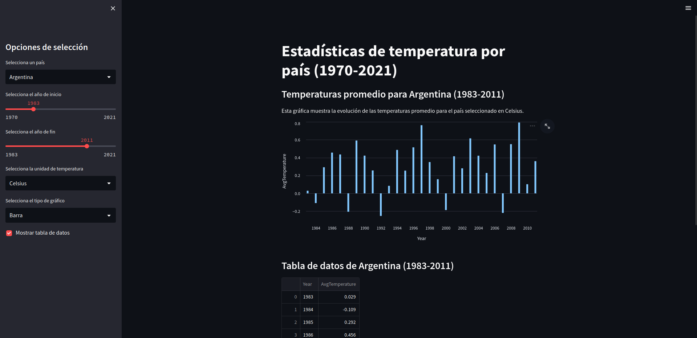

# Cuadro de mandos - Temperatura global por paises

## 1. Datos

He descargado los datos desde [Kaggle](https://www.kaggle.com/berkeleyearth/climate-change-earth-surface-temperature-data), son un conjunto de estadísticas de temperatura de todos los países desde 1970 hasta 2021.

El archivo CSV contiene las siguientes columnas:

- **Country**: El nombre del país.
- **Year**: El año para el cual se registró la temperatura.
- **AvgTemperature**: La temperatura promedio para ese país y ese año, en grados Celsius.
- **StandardDeviation**: La desviación estándar de la temperatura promedio para ese país y ese año, en grados Celsius.
- **Uncertainty**: El nivel de incertidumbre para la temperatura promedio para ese país y ese año, en grados Celsius.

Estos datos pueden ser útiles para analizar y comparar las tendencias de temperatura en diferentes países y regiones, así como para estudiar los efectos del cambio climático a lo largo del tiempo. Hay que tener en cuenta que estos datos son estadísticas y no mediciones precisas de la temperatura, y que pueden contener errores y limitaciones que deben tenerse en cuenta al analizarlos.

## 2. Instalación

```bash
python3 -m venv env

source env/bin/activate

pip install streamlit

pip install -r requirements.txt
```

## 3. Ejecución

```bash
streamlit run app.py
```

## 4. Descripción

He creado una barra lateral con unas opciones de selección, se puede elegir un país, el año de inicio, el año de fin
la unidad de temperatura _(Celsius o Farenheit)_y el tipo de gráfico _(lineal, puntos o barras)_.

Por ultimo un checkbox que muestra una tabla detallada con la temperatura por año del pais seleccionado.

Los filtros se aplican de la siguiente manera:

```python
# Filtrar los datos según las selecciones del usuario
columnas = ['Country Name'] + [str(anio) for anio in range(inicio, fin+1)]
df_filtrado = df.loc[df['Country Name'] == pais, columnas]

# Convertir los datos a formato largo (long format) y tipo fecha
df_filtrado = df_filtrado.melt(
    id_vars=['Country Name'], var_name='Year', value_name='AvgTemperature')
df_filtrado['Year'] = pd.to_datetime(df_filtrado['Year'], format='%Y')

# Convertir la temperatura a la unidad seleccionada por el usuario
if unidad_temp == 'Fahrenheit':
    df_filtrado['AvgTemperature'] = df_filtrado['AvgTemperature'].apply(
        lambda x: (x * 1.8) + 32)

# Crear la gráfica de temperatura
if tipo_grafico == 'Línea':
    chart = alt.Chart(df_filtrado).mark_line().encode(
        x='Year',
        y='AvgTemperature'
    )
elif tipo_grafico == 'Punto':
    chart = alt.Chart(df_filtrado).mark_point().encode(
        x='Year',
        y='AvgTemperature'
    )
else:
    chart = alt.Chart(df_filtrado).mark_bar().encode(
        x='Year',
        y='AvgTemperature'
    )
```



## 5. Despliegue
